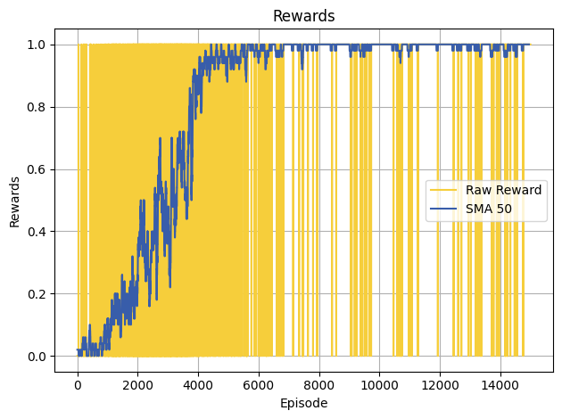
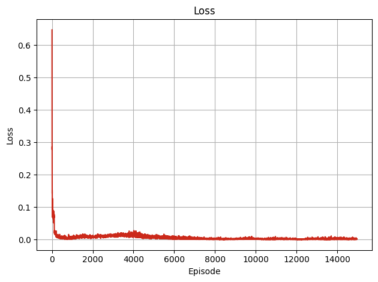
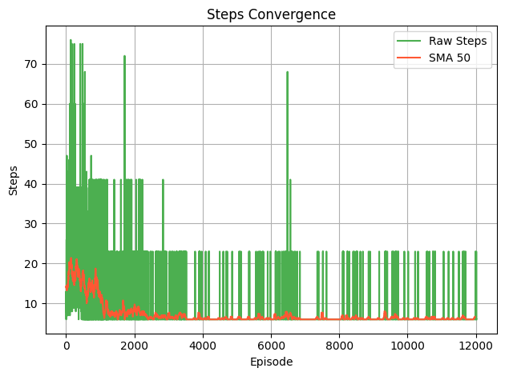
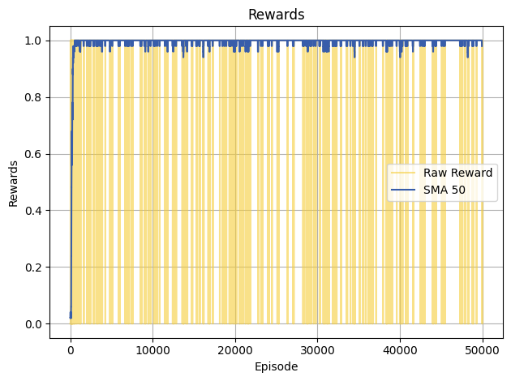
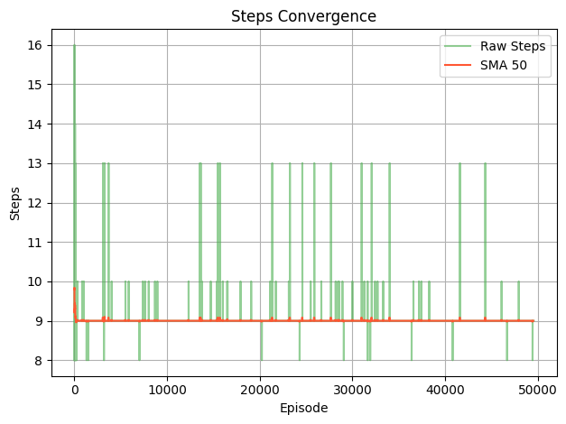

# STA303 Artificial Intelligence, Final Report

|    Hao Zhang     |   12210801   |
| :--------------: | :----------: |
| **Jiayang Jing** | **12210808** |
|   **Qijia He**   | **12111211** |


## 01 Installation

```bash
git clone https://github.com/Heqijia/STA303
cd STA303
conda create --name STA303 python=3.9
conda activate STA303

pip install -r requirements.txt
```


## 02 Introduction

This project focuses on intelligent navigation on an icy surface using reinforcement learning, set in the context of the *FrozenLake-v1* environment from the Gymnasium library. The goal is to train an agent to navigate from the starting point to the destination while avoiding falling into ice holes.

Centered around Q-learning, this project implements six algorithms from traditional and advanced methods:

- `Vanilla Q Learning`
- `SARSA`

- `Deep Q Learning`
- `Double DQN`
- `Dueling DQN`
- `Prioritized Experience Replay (PER)`

In addition to these methods, we leveraged the observable properties of the icy environment to enhance the learning process. Specifically, we applied **probabilistic transition modeling** for a Q-table warm start and combined **Q-learning with A\* search** to significantly reduce the agent's exploration cost in the early stages of training.

Details of the algorithms and analysis can be seen in our report.


## 03 Files Description

- `forzenlake_q_learning.ipynb`

  An implementation of Q leaning algorithm based on *FronzenLake*

- `SARSA.ipynb`

  An implementation of SARSA algorithm based on *FronzenLake*

- `frozenlake_dqn.ipynb`

  An implementation of Vanilla DQN, dueling DQN, Double DQN and PER based on *FrozenLake*

  The choice of using dueling, double, or PER methods in the DQN model is specified in the `__main__` section during the initialization of the agent and trainer.

  ```  python
  env = gym.make(
      'FrozenLake-v1', 
      map_name=f"{config['map_size']}x{config['map_size']}", 
      is_slippery=True, 
      max_episode_steps=config['max_steps'], 
      render_mode="human" if config['render'] else None)
  
  env.reset(seed=seed)
  env.action_space.seed(seed)
  env.metadata['render_fps'] = config['render_fps']
  
  # Create agent and trainer
  agent = DQNAgent(env, config, dueling=False, priority=False)
  trainer = Trainer(env, agent, config, double_dqn=False)
  
  # Train or test
  if config['train_mode']:
      trainer.train()
  else:
      trainer.test()
  ```

- `Q_learning_with_prompt.ipynb`

  An implementation of Vanilla DQN with A* search algorithm based on *FrozenLake*.

- `utils.py`

  Helper Functions.

- `agent/` 

  Agent Class.
  
- `vis/`

  A visualization dashboard of Q table for several examples.


## 04 Results

Here we provide some configuration examples that provide good result:

- Vanilla DQN:

  ```python
  seed = 1
  config = {
      "train_mode": train_mode,
      "method_name": method_name,
      "model_dir": f'output/{method_name}/model/{map_size}x{map_size}/',
      "plot_dir": f'output/{method_name}/plt/{map_size}x{map_size}/',
      "save_interval": 500,
      "print_interval": 100,
      "clip_grad_norm": 5,
      "learning_rate": 4e-4,
      "discount_factor":0.9,
      "batch_size": 32,
      "update_frequency": 30,
      "max_episodes": train_episodes if train_mode else 10,
      "train_episodes": train_episodes,
      "max_steps": 200,
      "render": render,
      "epsilon_max": 0.99 if train_mode else -1,
      "epsilon_min": 0.001,
      "epsilon_decay": 0.999,
      "memory_capacity": 5000 if train_mode else 0,
      "map_size": map_size,
      "render_fps": 6,
  }
  ```

  

  <div style="display: flex; justify-content: center; align-items: center; gap: 10px;">
    
    
    
  </div>


- Vanilla Q learning:

  ```python
  seed = 10
  config = {
      "train_mode": train_mode,
      "model_dir": f'output/{method_name}/model/{map_size}x{map_size}/',
      "plot_dir": f'output/{method_name}/plt/{map_size}x{map_size}/', 
      "save_interval": 5000,
      "print_interval": 500,
      "learning_rate": 0.001,
      "discount_factor": 0.92,
      "max_episodes": train_episodes if train_mode else 10,
      "train_episodes": train_episodes,
      "max_steps": 1000,
      "render": render,
      "epsilon_max": 0.995 if train_mode else -1,
      "epsilon_min": 0.001,
      "epsilon_decay": 0.99,
      "map_size": map_size,
      "render_fps": 6,
  }
  ```

<div style="display: flex; justify-content: center; align-items: center; gap: 10px;">
  
  
</div>
